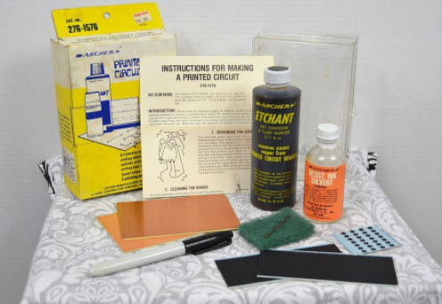

# Forrest Mims Engineers Notebook

http://kisi.deu.edu.tr//ozgur.oz/20XX/The_Forrest_Mims_Engineers_Notebook_1992_Temiz_V4-conv.pdf
  - Mims_1.jpg (cover)
  - Mims_2.jpg (page 58 -- BCD to 8 segment)
  
# Radio Shack Battery of the Month

http://captalk.net/index.php?topic=24521.0
  - battery_of_the_month.jpg
  
# Radio Shack 160-in-1

https://www.reddit.com/r/nostalgia/comments/5dkuj4/classic_radio_shack_160in1_electronics_project_kit/
  - project_kit.jpg
  
# Drill

https://www.waymil.com/MINIATURE-PLASTIC-HAND-DRILL-p/402-051.htm
  - drill.jpg
  
# Radio Shack Etchant

https://www.pinterest.cl/pin/119415827600935768/
  - etch.jpg

# Hot CoCo Magazine

https://colorcomputerarchive.com/repo/Documents/Magazines/Hot%20CoCo%20(Searchable%20image)/Hot%20Coco%20Vol.%202%20No.%202%20-%20July%201984.pdf
  - coco1.jpg
  - coco2.jpg
  - coco3.jpg
  - coco4.jpg 

https://colorcomputerarchive.com/repo/Documents/Magazines/Hot%20CoCo%20(Searchable%20image)/Hot%20Coco%20Vol.%202%20No.%208%20-%20January%201985.pdf
  -  coco5.jpg
  -  coco6.jpg

