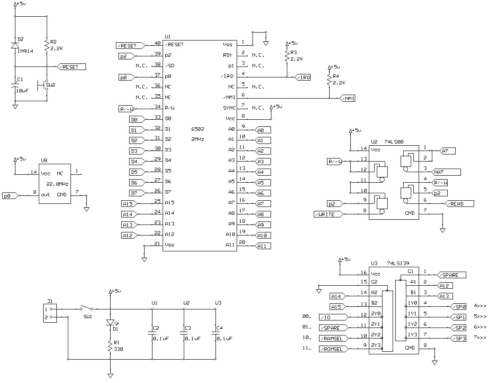
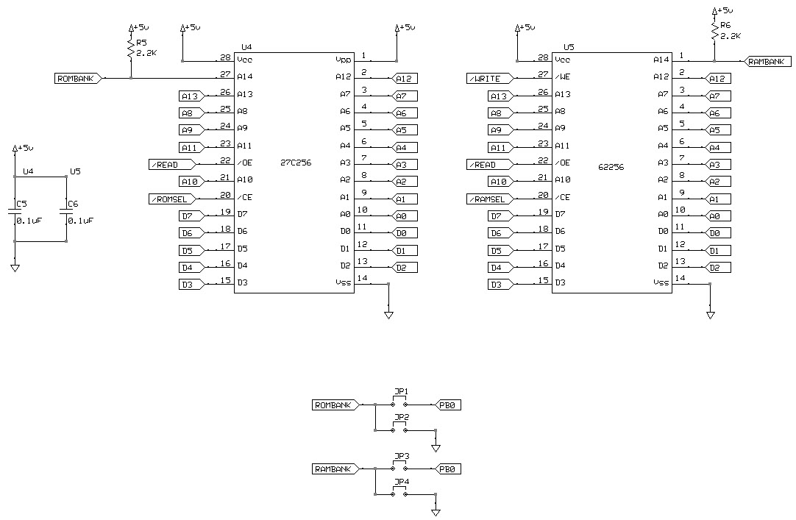
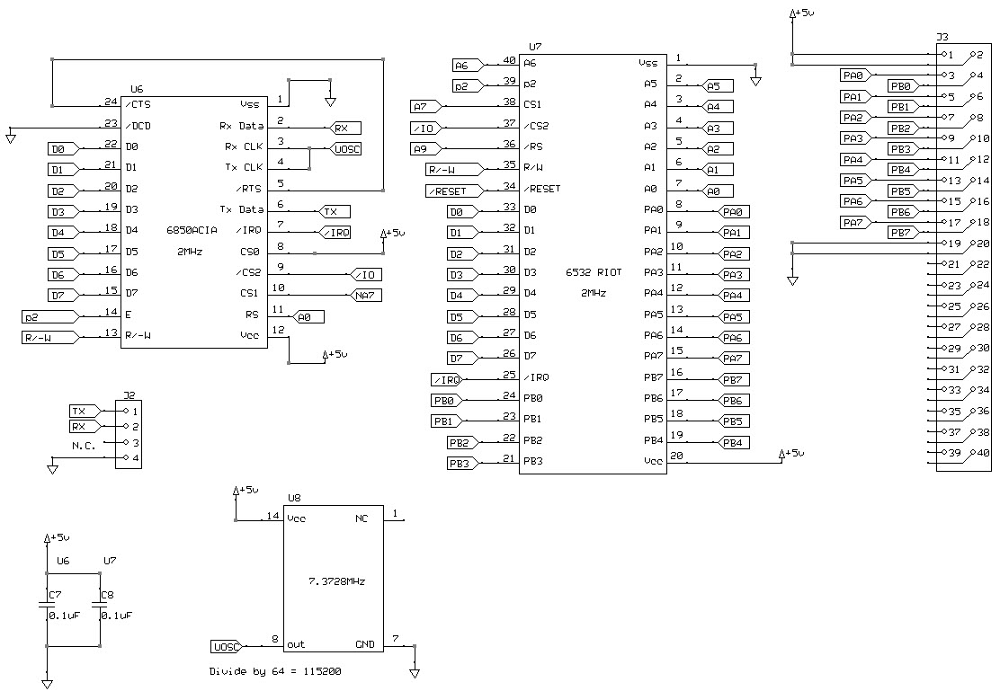

# Schematic







# Memory Map

```
11_xxxxxx_xxxxxxxx ROM 16K
10_xxxxxx_xxxxxxxx RAM 16K

01_00xxxx_xxxxxxxx Spare 0 4K
01_01xxxx_xxxxxxxx Spare 1 4K
01_10xxxx_xxxxxxxx Spare 2 4K
01_11xxxx_xxxxxxxx Spare 3 4K

00_xxxxxx_xxxxxxxx I/O (see below)

00_xxxxxx0xxxxxx0 UART Control/Status
00_xxxxxx0xxxxxx1 UART Transmit/Receive

00_xxxx0x1xxxxxxx RAM (128 bytes)
00_xxxx1x1xxxx000 Data A
00_xxxx1x1xxxx001 DDRA
00_xxxx1x1xxxx010 Data B
00_xxxx1x1xxxx011 DDRB

00_xxxx1x1xx0x1bc (write) edge detect control
00_xxxx1x1xxxa1x0 (read) timer
00_xxxx1x1xxxx1x1 (read) interrupt flags
00_xxxx1x1xx1a100 (write) div 1T
00_xxxx1x1xx1a101 (write) div 8T
00_xxxx1x1xx1a110 (write) div 64T
00_xxxx1x1xx1a111 (write) div 1024T

TODO check Stella for more on the RIOT

0000        UART Control/Status
0001        UART Transmit/Receive
0080 - 00FF RAM
0180 - 01FF RAM mirror (stack)
0280        Data A
0281        DDRA
0282        Data B
0283        DDRB
0284        Timer output (read only)
0294        Set 1 clock interval (write only)
0295        Set 8 clock interval (write only)
0296        Set 64 clock interval (write only)
0297        Set 1024 clock interval (write only)

4000 - 7FFF Spare select space (4xxx, 5xxx, 6xxx, 7xxx)

8000 - BFFF RAM

C000 - FFFF ROM

FFFA - FFFB NMI
FFFC - FFFD RESET
FFFE - FFFF IRQ
 
```