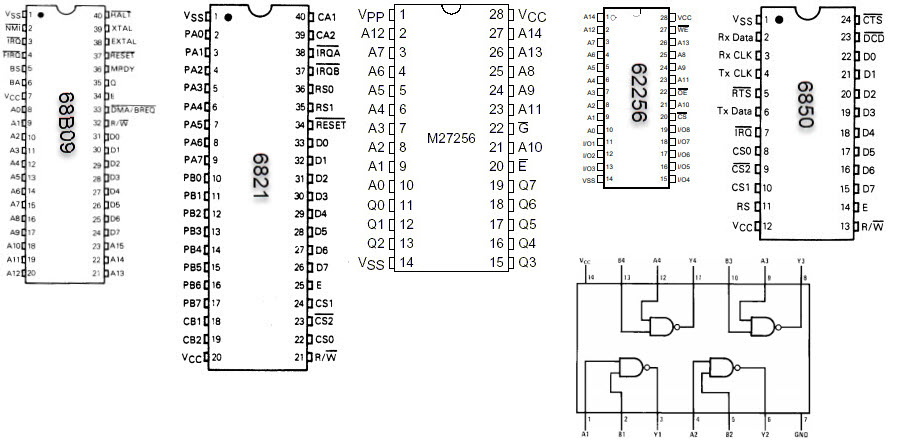
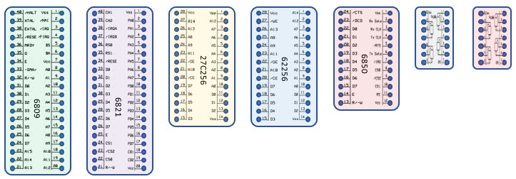

# Schematic

Click for [Schematics](/6502/SCHEMATICS.md)

I am using the basics from here: [https://easyeda.com/tranter/6809-Single-Board-Computer](https://easyeda.com/tranter/6809-Single-Board-Computer)

## 68B09CP Processor

The 68B09 does not require an external clock driver -- just a crystal.

MOTOS07600-1.pdf says "The crystal or external frequency is four times the bus frequency. 8MHz crystal would be 2MHz. I am
using 7.3728MHz resulting in 1.8432Mhz. 

Note that 7372800 / 4 / 16 = 115200. This lets us use the same clock for the UART chip.

# Address Decoding

```
## RAM

A15 = 0

0xxx_xxxx_xxxx_xxxx RAM

## PIA

A15, A14, A13 = 100

100x_xxxx_xxxx_xx00 Data-A
100x_xxxx_xxxx_xx01 Ctrl-A
100x_xxxx_xxxx_xx10 Data-B
100x_xxxx_xxxx_xx11 Ctrl-B

## ACI

A15, A14, A13 = 101

101x_xxxx_xxxx_xxx0 Control
101x_xxxx_xxxx_xxx1 Data

## ROM

A15, A14 = 0

11xx_xxxx_xxxx_xxxx ROM
```

# Memory Map from Above Decoding

```
0000 - 7FFF RAM
;
8000        PIA Data-A
8001        PIA Ctrl-A
8002        PIA Data-B
8003        PIA Ctrl-B
;
A000        ACI Control
A001        ACI Data
;
C000 - FFFF ROM (and vectors)
```

## Labels





## Projects
  - [HiLo](hilo)
  - [Pyramid](pyramid)

## Software
  - [hardware.asm](hardware.asm) - include file defines for the hardware
  - [load1.asm](load1.asm) - interface with propeller through the PIA
  - [load2.asm](load2.asm) - interface with propeller through the PIA
  - [monitor_serial.asm](monitor_serial.asm) - early binary monitor (needs external control program)
  - [monitor.asm](monitor.asm) - early binary monitor (needs external control program)
  - [newMonitor.asm](newMonitor.asm) - standalone interactive monitor over serial port (ASCII interface)


