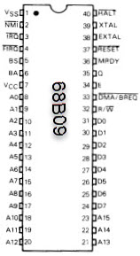
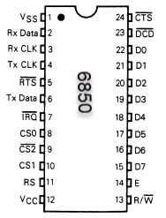
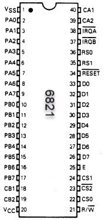
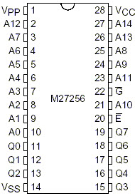
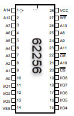
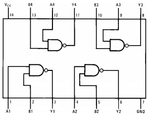

# 6809 Board

I am using the basics from here: [https://easyeda.com/tranter/6809-Single-Board-Computer](https://easyeda.com/tranter/6809-Single-Board-Computer)

## 68B09CP Processor

I bought a chip on ebay.

The 68B09 does not require an external clock driver -- just a crystal.

CP seems to mean "plastic" and "industrial temp range".

MOTOS07600-1.pdf says "The crystal or external frequency is four times the bus frequency. 8MHz crystal would be 2MHz. I am
using 7.3728MHz resulting in 1.8432Mhz. 

Note that 7372800 / 64 = 115200. This lets us use the same clock for the UART chip.

Datasheet: [MC6809.pdf](MC6809.pdf)

Spacing 40: 0.1 (pin), 0.6 (row)

## 6850 Asynchronous Communications Interface Adapter

Datasheet: [MC6850.pdf](MC6850.pdf)

Spacing 24: 0.1 (pin), 0.6 (row)

## 6821 Peripheral Interface Adapter

Datasheet: [MC6821.pdf](MC6821.pdf)

Spacing 40: 0.1 (pin), 0.6 (row)

## 27C256 EPROM

Datasheet: [datasheet_27C256.pdf](datasheet_27C256.pdf)

Spacing 28: 0.1 (pin), 0.6 (row)

## 62256 Static RAM

Datasheet 28: [62256_Samsungsemiconductor.pdf](62256_Samsungsemiconductor.pdf)

## 7400

Spacing 14: 0.1 (pin), 0.280 (row)

## Circuit

## Wire Warp IDs

