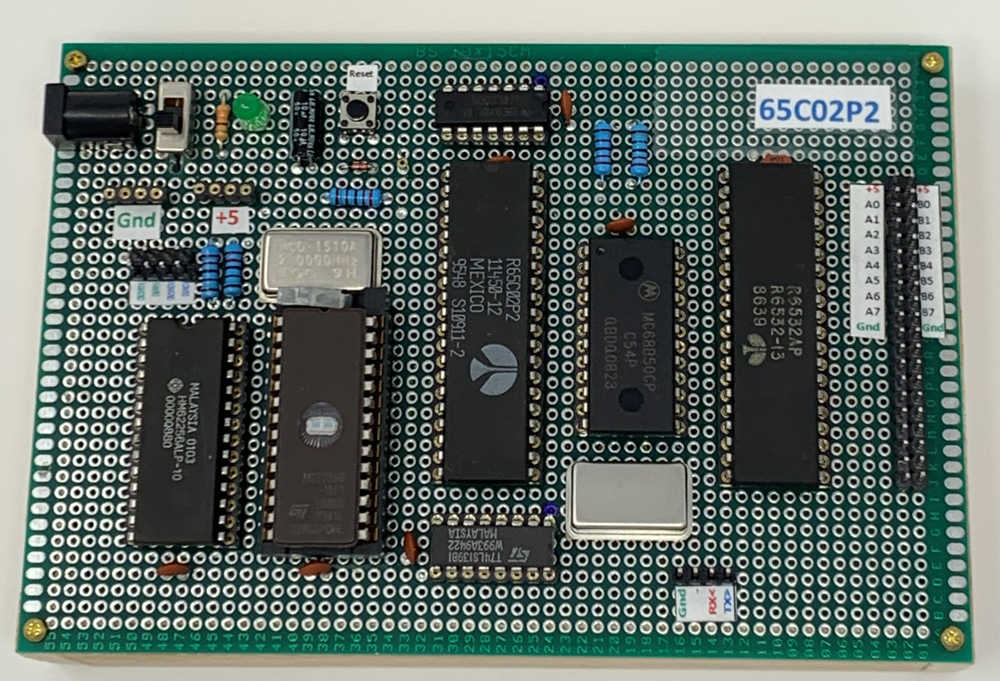
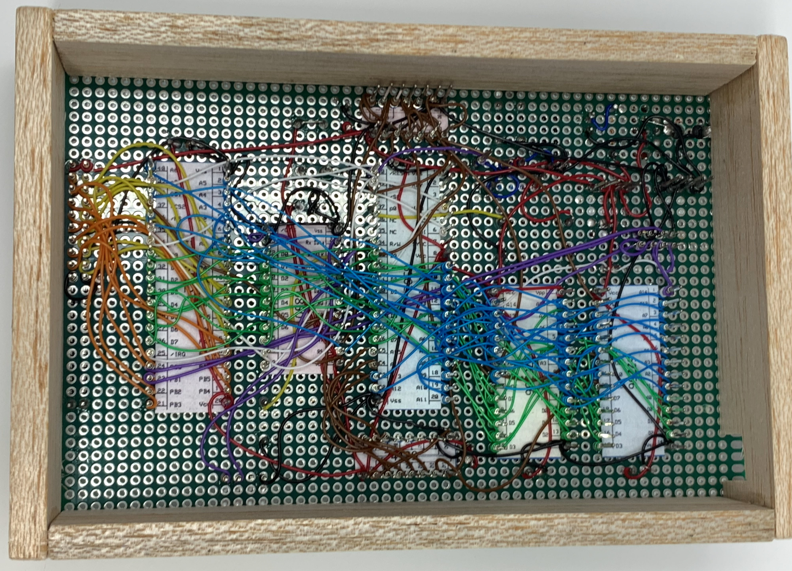
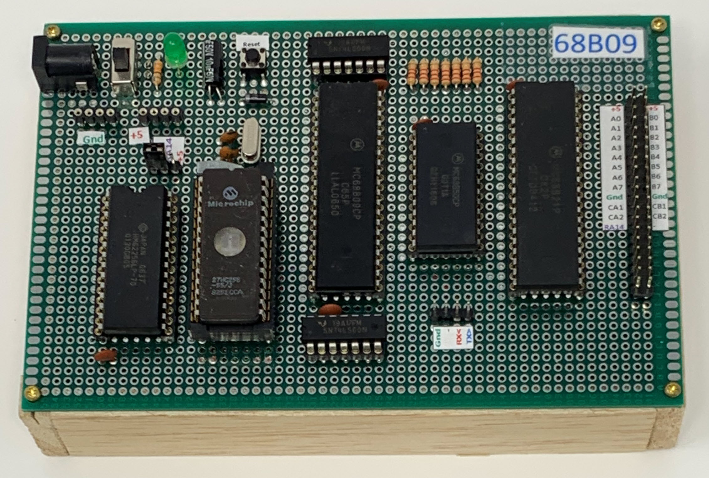
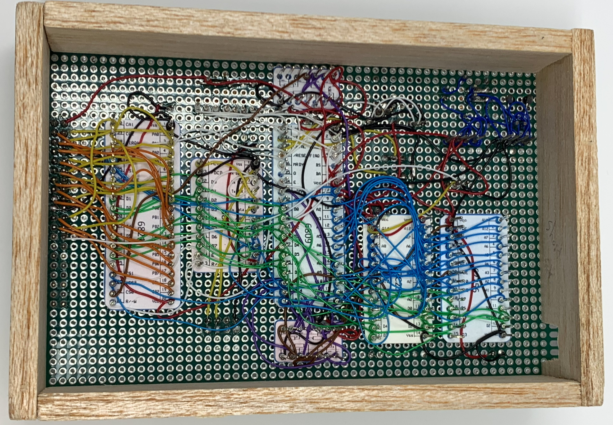

# Single Board Computers in many flavors

All point-to-point wired on breadboards.

## 6502

  - CPU: 65C02 running at 2MHz
  - RAM: 16K (32K as two banks of 16K switchable by jumpers or software plus 128 bytes in RIOT chip)
  - ROM: 16K (32K as two banks of 16K switchable by jumpers or software)
  - IO: 6532 Riot chip (used by Atari2100)
  - Serial: 6850ACIA

Complete info on the [6502](/6502/README.md) computer.

## Atari 2600 Cartridge Hack

[Atari 2600 Cartridge](/atari2600/README.md)

## 6809

  - CPU: 68B09 running at 7.3728MHz
  - RAM: 32K 
  - ROM: 16K (32K as two banks of 16K switchable by jumpers or software)
  - IO: 6821 PIA (used by TRS80 Color Computer)
  - Serial: 6850ACIA

Complete info on the [6809](/6809/README.md)

## Z80

TBD

## 8086 (V20)

TBD

# Programmer and Eraser

There are easier-to-use programmable ROMs these days. You can use an electrically erasable
programmable ROM instead of a UV erasable. 

https://www.amazon.com/PRG-113-GQ-universal-programmer-Adapter/dp/B011HVON3A

## Assemblers

TODO link to opcodetools

## Monitor program

TODO