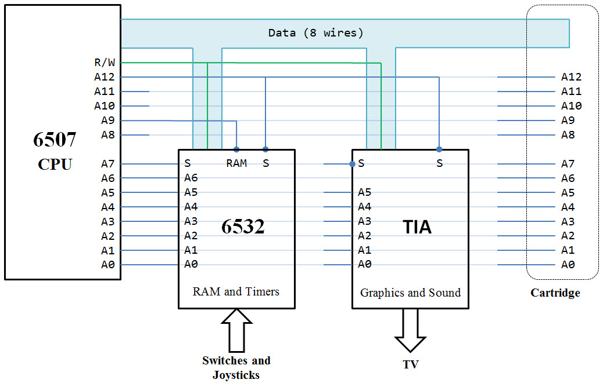
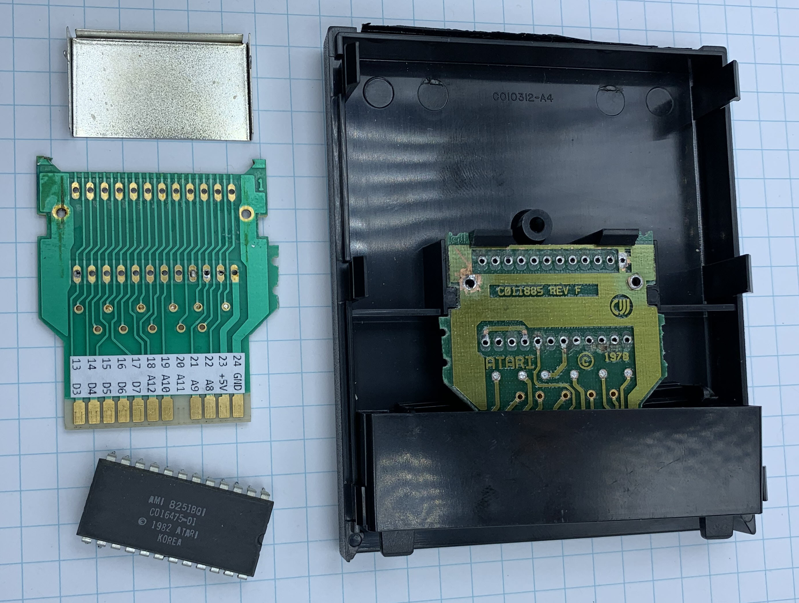
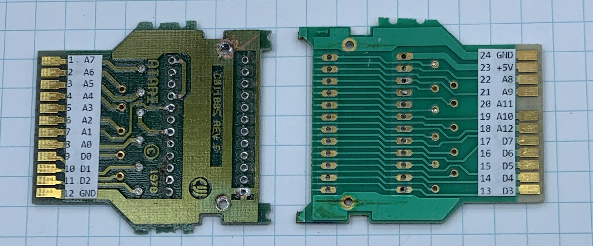
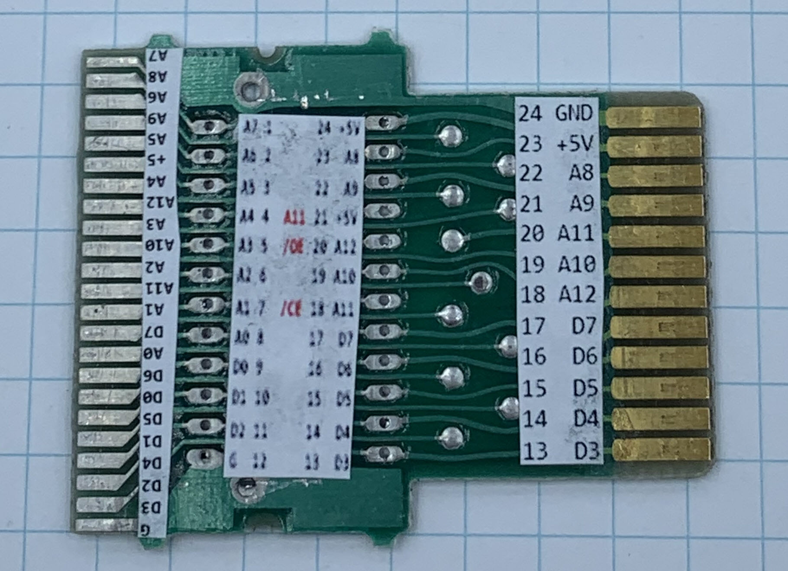
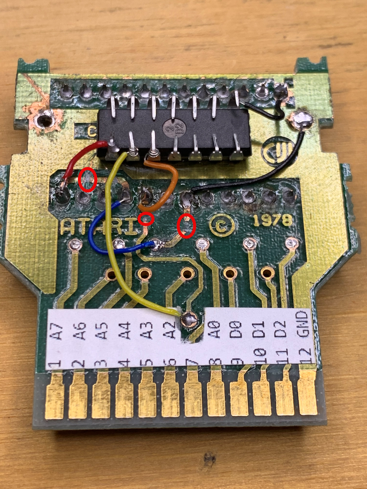
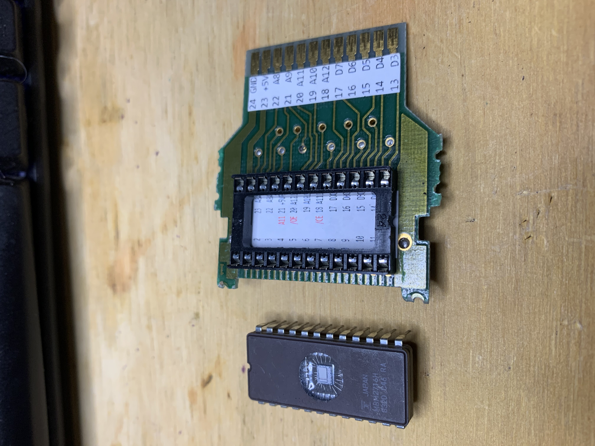
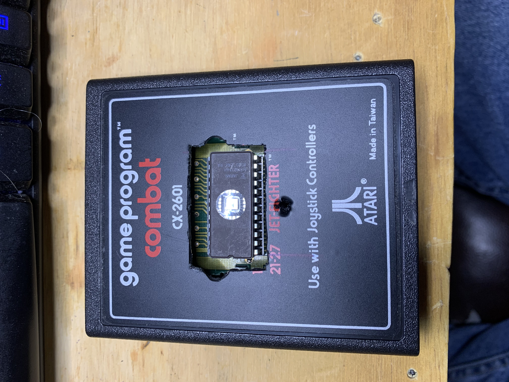
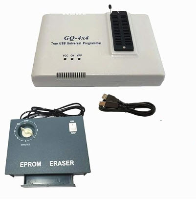
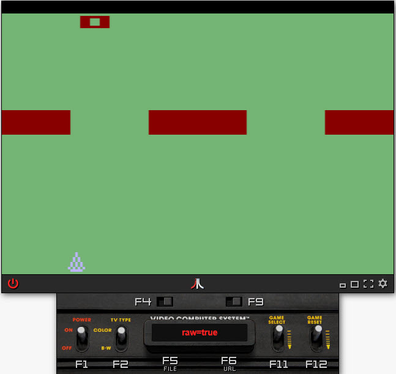

# Making your own Atari 2600 Cartridge

The simple Atari 2600 system shcematics:

There are many flavors of cartridges for the Atari 2600. Many of the later games used
bank switching for RAM and ROM in the cartridge. 

The earlier cartridges were simple. The `Combat` game uses a single 2K ROM chip.

The ROM chip is very similar to a standard EEPROM pinout, but the Atari 2600 needs for the
ROM to be active-high chip-select where a standard EEPROM is active-low chip-select. Atari
fabricated its own ROM chips to save an inverter in the cartridge.

The hack here involves removing the existing ROM chip and placing a DIP socket for a 2K
EEPROM. The needed inverter is glued to the back of the PC board.

First, get yourself a Combat cartridge (or other 2K cartridge) and desolder the ROM chip. I printed
a pin label using Microsoft Word and glued it to the board:

Notice that the contact for A11 is missing. 4K boards would have this pad. 4K is as big as the ROM
can be without bank-switching hardware (built into the 8K ROM of Asteroids). I used this for my first
cartridge. For the next iteration, I used a 4K board with all the pads.

Here are both sides of the labeled board:

Next, I found myself a 4K cartridge (Missile Command). The cartridge PCB includes an additional
card-edge connector with all the signals. Was this compatible with other Atari systems so that
they could sell the board in another form factor that uses the other side?

I made a label for the 2K EEPROM socket. I also labeled the traces at the end of the board for
future use? I have yet to use them.

Next, I glued the 7404 hex inverter to the bottom of the PCB. You can see the black ground wire
to the ship and the red 5V wire. Notice I cut the trace feeding 5V to pin 21 of the old EEPROM.
The cut is near the red wire in the picture.

The yellow wire is the A12 signal. I had to peel part of the label off to get to the pad. This 
signal goes to the inverter then through the orange wire to the /0E (pin 20) of the EEPROM. When 
A12 is high, the EEPROM is selected. The Atari2600 is a reduced pin-count chip. It has no A13, A14, 
nor A15. A12 is the top dog on the addres bus.

I cut the old trace for A11. You can see the cut near the orange wire

You see another black wire grounding the /CS (pin 18) of the EEPROM.

I soldered the DIP socket to the front of the PCB.

I cut a square window the cartridge case. I can remove/program/reinstall the
EEPROM through this window.

# Programmer and Eraser

https://www.amazon.com/PRG-113-GQ-universal-programmer-Adapter/dp/B011HVON3A

# The DoubleGap Game

I made this Atari2600 game long, long ago:

https://github.com/topherCantrell/doublegap

https://www.youtube.com/watch?v=xcmxLo47WdA

Play it online:

https://javatari.org/?ROM=https://github.com/topherCantrell/computerarcheology/blob/master/content/Atari2600/DoubleGap/DoubleGap.bin?raw=true
