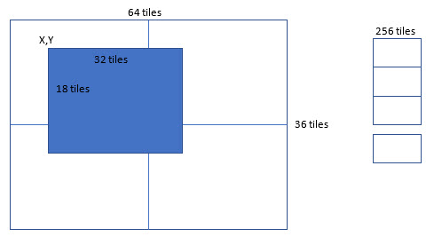

# Serial Tile Engine

The tile engine renders a rectangular map of tiles on the PI monitor. Each tile is 32x32 pixels. 

There are 4 view ports that can be configured separately. The controller configures the width, 
height, screen-x, and screen-y of the rendered map. Any non-rendered tile is filled with the
configured tile.

The tile engine maintains an internal world buffer of 64x32 tiles. The controller sets the X,Y
of the viewport.

The tile engine has a list of 256 tiles. The controller uploads the pixel data for the
tiles.



## 6809 library

Display buffers:
  - 0x4000 - 0x05FF
  - 0x0600 - 0x07FF

Control structure: 0x0800 - 0x08FF

World map: 0x0900 - 0x10FF
```
- width, height, dx, dy, vx, vy, _, _,
- width, height, dx, dy, vx, vy, _, _,
- width, height, dx, dy, vx, vy, _, _,
- width, height, dx, dy, vx, vy, _, _,
- backTile, activeDisplayPage
```

`mode(m)` 128,m: Set the display operating mode. 0=plain text background (no tile engine), 1=tile engine

`setTile(n,data)` 129,n,128_bytes: Set the pixel data for the given tile

`setMap(worldx,worldy,value)` 130,x,y,v: Set the display map to the given value

`configureView(n,screenx,screeny,width,height,blanktile)` 131: n,screenx,screeny,width,height,blanktile

`setView(n,worldx,worldy)` 132,n,x,y: Set the viewport coordinates

`fill(worldx1,worldy1,width,height,value)` 133,n,x1,y1,w,h,v: Fill a rectangle of the world map

`update()` 134: Update the display (changes are kept internally until this is called)
